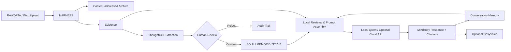

# LifeContext L1

> 把散落的人生数据，变成可追溯、可校正、可运行的数字自我。  
> Turn scattered life data into a traceable, correctable, and runnable digital self.


[中文](#中文) · [English](#english) · [项目结构](#项目结构) · [Project structure](#project-structure)

---

<a id="中文"></a>

## 中文

LifeContext L1 是一个本地优先的个人人生上下文操作系统。它把用户主动授权的文档、聊天记录、口述史和声音资料，转化为一条可审查的数据链：

```text
原始资料 → Archive → Evidence → ThoughtCell → 人工审核
        → SOUL / MEMORY / STYLE → Mindcopy → 对话与 Agent
```

项目试图回答一个具体的工程问题：如果要让 AI 真正理解一个人，我们应该怎样保存个人数据，怎样区分原始证据与模型推断，又怎样让每一项人格和记忆都能够回到来源？

LifeContext 将这一目标称为 **L1 意识上传**：基于个人表达数据，重建可测试的语言风格、记忆线索、价值倾向和决策模式。L1 衡量的是行为与表达层面的相似性，**不声称主观意识已经被转移，也不证明数字代理与生物主体具有严格同一性**。

### 为什么需要 LifeContext

普通的个人知识库擅长“找到一段资料”，但一个长期数字自我还需要回答更多问题：

- 这段记忆来自哪里，能否定位到原文件？
- 这是本人说过的话，还是模型的推断？
- 这项判断是否经过本人确认？
- 它在什么时期成立，后来是否发生变化？
- 当证据相互冲突时，系统应该怎样表达不确定性？
- 更换模型以后，个人数据和人格结构能否继续使用？

LifeContext 的核心不是训练一个不可迁移的“替身模型”，而是建设一套独立于模型的、可追溯的人生上下文基础设施。

## 核心概念

| 概念 | 作用 |
|---|---|
| **Archive** | 按内容哈希保存原始文件快照，避免处理结果覆盖原始资料。 |
| **Evidence** | 带来源文件、定位信息和说话者标记的证据片段。 |
| **ThoughtCell** | 从 Evidence 中提取的事件、观点、偏好、决定、反思或认知变化。 |
| **SOUL.md** | 身份、自我认知、价值观、目标和决策原则。 |
| **MEMORY.md** | 已确认的人生经历、重要关系、项目和认知转折。 |
| **STYLE.md** | 语言习惯、表达节奏、交流偏好和风格边界。 |
| **Mindcopy** | 由人格文件、相关证据、会话记忆和运行规则组装出的 L1 数字自我。 |
| **LifeContext** | 从原始资料到可运行 Mindcopy 的完整本地数据与上下文系统。 |

## 当前能力

本仓库仍处于 **Alpha / research prototype** 阶段。下表区分了已经可运行的能力与仍在建设中的部分。

| 能力 | 状态 | 说明 |
|---|---:|---|
| 文件夹驱动的数据导入 | ✅ | 监听 `RAWDATA/`，也支持从网页拖入文件。 |
| 文档解析 | ✅ | 支持 TXT、Markdown、JSON、CSV、HTML、PDF 和 DOCX。 |
| 内容哈希与原始归档 | ✅ | 原始文件进入本地 Archive，支持去重与重新处理。 |
| Evidence 生成 | ✅ | 保存来源、定位信息和原始片段。 |
| ThoughtCell 提取与审核 | ✅ | 本地模型提取；用户可以确认、排除或保留待审核状态。 |
| ThoughtCell 知识图谱 | ✅ | 在前端查看思想节点、类型、来源和关联。 |
| 人生时间线 | ✅ | 根据已提取内容生成可浏览的时间视图。 |
| 人生访谈 / 口述史 | ✅ | 用户填写的内容直接生成高可信 Evidence 与 ThoughtCell。 |
| SOUL / MEMORY / STYLE | ✅ | 支持查看人格文件，并与动态编译内容共同作用于 Prompt。 |
| 本地 Mindcopy 对话 | ✅ | 使用 llama.cpp 运行 Qwen3-4B GGUF，支持文本流式输出。 |
| 本地会话记忆 | ✅ | 按会话保存近期对话；长期信息先进入待确认记忆。 |
| 云端最终推理 | ✅ | 支持 OpenAI-compatible API；本地完成检索和 Prompt 组装。 |
| 音色档案与流式语音 | 🧪 | 可连接 CosyVoice 进行授权音色克隆；GPU 环境配置仍较复杂。 |
| L1 自动化评测 | 🚧 | 已有界面和规范方向，正式基准集与回归流水线仍在开发。 |
| 完整导出与可验证删除 | 🚧 | 数据格式已保持可读，产品级导出/删除工作流尚未完成。 |
| 多用户、登录和公网部署 | ❌ | 当前仅面向单机个人使用，不应直接暴露在公网。 |

## 系统架构



### 记忆分层

LifeContext 不把所有数据混合进一个向量库，而是保留六个边界清晰的层级：

1. **Archive**：不可变的原始资料。
2. **Evidence**：可定位、可引用的证据片段。
3. **ThoughtCell**：由模型提取、等待本人审核的语义记忆。
4. **Persona**：经过审核、可版本化的 SOUL / MEMORY / STYLE。
5. **Conversation**：按 `session_id` 隔离的本地对话记录。
6. **Working Context**：每次推理时临时组装的有限上下文。

模型输出不会自动冒充个人历史。对话中新出现的偏好、决定、身份信息和人生事件，只会先成为 `unreviewed` 候选；经本人确认后，才能进入后续对话的长期记忆。

## 快速开始

### 运行环境

当前本地运行环境面向 **Windows 10/11**：

- Python 3.11 或更高版本；
- 管理中台与云端 API 模式不要求独立显卡；
- 本地 Qwen3-4B 使用约 2.5 GB 的 GGUF 权重，当前启动配置为 CPU 推理；
- CosyVoice 为可选能力，建议使用兼容 CUDA 的 NVIDIA GPU；
- 首次下载本地模型和运行时需要网络连接。

### 1. 获取源码并启动

```powershell
git clone <your-repository-url>
cd LIFECONTEXTOS-GITHUB
```

首次安装在项目根目录执行以下命令。已有 `.env` 时请保留原配置。安装采用可编辑模式，启动入口直接使用当前源码；本地模型和 CosyVoice 权重按需下载。

```powershell
py -3.11 -m venv .venv
.\.venv\Scripts\python.exe -m pip install --upgrade pip
.\.venv\Scripts\python.exe -m pip install -e ".[dev]"
if (-not (Test-Path .env)) { Copy-Item .env.example .env }
```

### 2. 选择推理方式

如果使用本地模型，下载 Qwen3-4B 和 llama.cpp 运行时：

```powershell
.\.venv\Scripts\python.exe scripts\download_local_model.py
.\.venv\Scripts\python.exe scripts\download_llama_runtime.py
```

如果只使用云端兼容接口，可以跳过模型下载。启动后前往“设置 → 云端模型访问”，填写 Provider、API Base URL、Model 和 API Key。

> 云端模式下，Archive、Evidence、ThoughtCell、人格文件、会话记忆和检索仍在本地。系统只把当前轮已经选取并组装好的最终 Messages 发送给所选服务商。这些 Messages 可能包含个人资料片段，请在启用前确认服务商的数据政策。

### 3. 启动 LifeContext

在项目根目录的 PowerShell 中运行：

```powershell
.\.venv\Scripts\lifecontext.exe serve
```

打开 <http://127.0.0.1:8787/ui/>。服务在前台运行，日志输出到终端，按 `Ctrl+C` 停止。重新运行同一命令即可重启 API。

开发时使用 `serve --reload`，仅监听后端源码，避免个人数据写入触发重载。支持 `--host` 和 `--port`；默认仅监听本机。入口自动读取项目 `.env`，已设置的环境变量优先。

也可使用 `.\.venv\Scripts\python.exe -m lifecontext_api serve`。新增命令入口后，已有环境需重新执行一次 `python.exe -m pip install -e ".[dev]"`（使用上方虚拟环境内的 Python）。

本地模型和 CosyVoice 在网页“运行中心”按需启动、停止或重启，API 重载不会主动结束这些独立服务。

## 第一次使用

1. 填写姓名、出生日期、身份、个人简介和当前目标。
2. 把本人有权处理的文件放入 `RAWDATA/`，或在资料入口拖入文件。
3. 等待 HARNESS 完成归档、Evidence 生成和 ThoughtCell 提取。
4. 在“思想元胞”页面确认或排除模型提取的内容。
5. 在“人生访谈”里补充仅靠历史文件难以获得的自我认识。
6. 打开“数字自我”，检查 SOUL、MEMORY、STYLE 和最终 Prompt。
7. 启动本地模型或配置云端接口，然后进入 Mindcopy 对话。

## 数据与隐私边界

- `data/`、`models/`、`.runtime/`、`.env` 和语音文件默认被 Git 忽略。
- 不要把真实聊天记录、音频、API Key 或未经授权的第三方资料提交到公开仓库。
- 云端 API Key 只保存在后端进程内存，不写入 `data/cloud/config.json`；关闭云端模式或停止后端后即被清除。
- 声音与人格授权相互独立。拥有一个人的文字资料，不代表拥有其声音克隆权。
- 当前版本没有登录、租户隔离、速率限制和完整加密，不适合直接部署到公网。
- 对真实人物构建 Mindcopy 时，应取得明确、具体、可撤回的授权，并清楚标注生成内容。

## 项目结构

```text
LifeContext-L1/
├─ apps/api/lifecontext_api/   # FastAPI、HARNESS、记忆与模型适配层
├─ apps/web/                   # 无构建步骤的本地管理中台
├─ RAWDATA/                    # 用户主动放入的待处理资料
├─ data/                       # 本地 Archive、Evidence、ThoughtCell 与配置
├─ templates/persona/                # 人格基线和口述史问题
├─ models/                     # 本地语言模型权重（不进入 Git）
├─ scripts/                    # 启动、重启、下载与 CosyVoice 服务脚本
├─ specs/                      # LifeContext JSON Schema
├─ examples/                   # 人格文件示例
├─ docs/                       # 理论、架构、记忆、路线图与语音说明
└─ tests/                      # 后端测试
```

## 主要 API

| 方法 | 路径 | 作用 |
|---|---|---|
| `GET` | `/v1/harness/summary` | 查看 HARNESS 与导入状态。 |
| `POST` | `/v1/harness/upload` | 把文件写入本地 RAWDATA。 |
| `GET` | `/v1/thought-cells` | 查询 ThoughtCell。 |
| `PATCH` | `/v1/thought-cells/{id}/review` | 审核 ThoughtCell。 |
| `GET/PUT` | `/v1/profile` | 读取或更新个人基础信息。 |
| `GET` | `/v1/persona/{document}` | 读取 SOUL、MEMORY 或 STYLE。 |
| `GET/PUT` | `/v1/oral-history/...` | 读取问题并保存口述史。 |
| `POST` | `/v1/mindcopy/chat/stream` | 流式生成 Mindcopy 回答。 |
| `GET/PUT` | `/v1/mindcopy/config` | 查看或编辑最终 Prompt 与推理参数。 |
| `GET/PUT` | `/v1/cloud-model/config` | 配置可选云端兼容接口。 |
| `GET/PATCH` | `/v1/memory/candidates/...` | 查看和审核对话记忆候选。 |
| `GET/POST` | `/v1/voice-profile/...` | 管理本人授权音色并生成试听。 |

启动后可在 `http://127.0.0.1:8787/docs` 查看由 FastAPI 生成的完整接口文档。

## 开发

```powershell
# 运行测试
.\.venv\Scripts\python.exe -m pytest -q

# 代码检查
.\.venv\Scripts\python.exe -m ruff check .

# 仅启动 API（开发模式）
.\.venv\Scripts\python.exe -m uvicorn lifecontext_api.main:app `
  --app-dir apps/api --reload --host 127.0.0.1 --port 8787
```

前端位于 `apps/web/`，由 FastAPI 直接提供静态文件，不需要 Node.js 构建步骤。

## 路线图

- [ ] 发布 LifeContext 1.0 开放数据规范与迁移工具。
- [ ] 完成十年聊天记录的专用导入器、说话者识别和时间规范化。
- [ ] 增加全文检索、向量召回、时间过滤与本地重排序的混合检索。
- [ ] 建立公开、可复现的 L1 意识上传评价基准。
- [ ] 完成 Mindcopy 版本差异、签名、回滚和可移植导出。
- [ ] 实现覆盖索引、缓存和派生物的可验证删除流程。
- [ ] 提供跨平台安装器、Docker 开发环境和端侧模型配置向导。
- [ ] 扩展低风险个人 Agent，并为每项外部行动提供独立授权和审计。

链上身份、NFT 交易、死后自治代理和脑机接口不属于早期产品承诺，应作为独立的研究与治理议题。

## 贡献

欢迎围绕以下方向提交 Issue 或 Pull Request：

- 聊天记录、日记、邮件和社交平台导入器；
- Evidence 与 ThoughtCell 数据规范；
- 本地检索、上下文压缩和记忆演化；
- L1 评测数据集和对照实验；
- 隐私、安全、授权、撤回与数字遗产治理；
- Windows 之外的安装和端侧推理支持；
- 中文与其他语言的文档、界面和测试。

提交代码前，请确保测试通过，并且示例数据完全虚构、已经脱敏或拥有明确公开授权。

## 许可证

当前仓库尚未包含 `LICENSE` 文件。在维护者选择并加入正式许可证之前，本仓库**还不能被视为已经授予开源复用许可**。建议在首次公开发布前明确采用 Apache-2.0、MIT、AGPL-3.0 或其他符合项目治理目标的许可证，并分别核对模型权重、CosyVoice 及其他第三方依赖的许可证。

---

<a id="english"></a>

## English

LifeContext L1 is a local-first operating system for personal life context. It turns documents, conversation exports, oral histories, and voice data that a person is authorized to use into a reviewable chain:

```text
Raw data → Archive → Evidence → ThoughtCell → Human review
         → SOUL / MEMORY / STYLE → Mindcopy → Conversation & Agents
```

The project addresses a practical engineering question: if an AI is expected to understand a person over time, how should personal data be preserved, how do we separate source evidence from model inference, and how can every memory or personality claim remain traceable to its origin?

We call this scope **L1 consciousness uploading**: reconstructing testable language style, memory cues, value tendencies, and decision patterns from a person's expression data. L1 measures behavioral and expressive similarity. It **does not claim that subjective consciousness has been transferred, nor that a digital agent is strictly identical to the biological person**.

### Why LifeContext

A conventional personal knowledge base can retrieve a passage. A long-lived digital self must answer harder questions:

- Where did this memory come from?
- Was it stated by the person or inferred by a model?
- Has the person reviewed it?
- During which period was it valid, and did it later change?
- How should conflicting evidence and uncertainty be represented?
- Can the data and identity structure survive a model or provider change?

LifeContext is therefore not primarily an attempt to train an irreplaceable replica model. It is model-agnostic infrastructure for a portable and traceable life context.

## Core concepts

| Concept | Role |
|---|---|
| **Archive** | Content-addressed snapshots that keep generated results from overwriting raw data. |
| **Evidence** | Source excerpts with file, locator, and speaker metadata. |
| **ThoughtCell** | An extracted event, claim, preference, decision, reflection, or cognitive shift. |
| **SOUL.md** | Identity, self-understanding, values, goals, and decision principles. |
| **MEMORY.md** | Reviewed experiences, relationships, projects, and cognitive transitions. |
| **STYLE.md** | Language habits, expression rhythm, interaction preferences, and style boundaries. |
| **Mindcopy** | An L1 digital self assembled from persona files, retrieved Evidence, conversation memory, and runtime rules. |
| **LifeContext** | The complete local data and context system from raw sources to a runnable Mindcopy. |

## What works today

This repository is an **alpha research prototype**. The table intentionally distinguishes working features from planned product capabilities.

| Capability | Status | Notes |
|---|---:|---|
| Folder-driven ingestion | ✅ | Watches `RAWDATA/` and accepts browser uploads. |
| Document parsing | ✅ | TXT, Markdown, JSON, CSV, HTML, PDF, and DOCX. |
| Hashing and raw archive | ✅ | Local content-addressed storage and deduplication. |
| Evidence generation | ✅ | Preserves source, locator, and raw excerpts. |
| ThoughtCell extraction and review | ✅ | Local extraction with confirm, reject, and unreviewed states. |
| ThoughtCell graph | ✅ | Visualizes thought types, sources, and relationships. |
| Life timeline | ✅ | Browsable temporal view derived from extracted context. |
| Guided oral history | ✅ | User-authored answers become high-trust Evidence and ThoughtCells. |
| SOUL / MEMORY / STYLE | ✅ | Inspectable persona files combined with dynamically compiled memory. |
| Local Mindcopy chat | ✅ | Qwen3-4B GGUF through llama.cpp with streamed text. |
| Local conversation memory | ✅ | Session-scoped history and review-gated long-term candidates. |
| Optional cloud inference | ✅ | OpenAI-compatible API; retrieval and prompt assembly stay local. |
| Voice profile and streaming TTS | 🧪 | Authorized voice cloning through CosyVoice; setup remains hardware-sensitive. |
| Automated L1 evaluation | 🚧 | UI and design direction exist; the reproducible benchmark is in progress. |
| Complete export and verified deletion | 🚧 | Human-readable storage exists; product workflows are not complete. |
| Multi-user or public deployment | ❌ | This release is a single-device prototype and must not be exposed directly. |

## Architecture


### Memory layers

LifeContext keeps six explicit memory boundaries instead of mixing everything into one vector database:

1. **Archive** — immutable source material.
2. **Evidence** — traceable and citable excerpts.
3. **ThoughtCell** — model-extracted semantic memory awaiting human review.
4. **Persona** — reviewed and versionable SOUL / MEMORY / STYLE.
5. **Conversation** — local turn history isolated by `session_id`.
6. **Working Context** — the bounded context assembled for a single inference call.

Model output is never automatically promoted into personal history. Preferences, decisions, identity facts, and life events found in a conversation first become `unreviewed` candidates. Only human-confirmed candidates can enter future long-term context.

## Quick start

### Requirements

The current local runtime targets **Windows 10/11**:

- Python 3.11 or newer;
- no discrete GPU is required for the management UI or cloud API mode;
- the local Qwen3-4B setup uses an approximately 2.5 GB GGUF file and currently runs on CPU;
- CosyVoice is optional and an NVIDIA CUDA-capable GPU is recommended;
- internet access is required for the initial runtime and model downloads.

### 1. Clone and start

```powershell
git clone <your-repository-url>
cd LIFECONTEXTOS-GITHUB
```

Run the following commands from the project root for first-time setup. Keep your existing `.env` if present. Editable installation runs the current source checkout; model weights are downloaded separately as needed.

```powershell
py -3.11 -m venv .venv
.\.venv\Scripts\python.exe -m pip install --upgrade pip
.\.venv\Scripts\python.exe -m pip install -e ".[dev]"
if (-not (Test-Path .env)) { Copy-Item .env.example .env }
```

### 2. Choose an inference mode

For local inference, download Qwen3-4B and the llama.cpp runtime:

```powershell
.\.venv\Scripts\python.exe scripts\download_local_model.py
.\.venv\Scripts\python.exe scripts\download_llama_runtime.py
```

If you only want an OpenAI-compatible cloud endpoint, skip the model downloads. After startup, open **Settings → Cloud model access** and enter the provider, API base URL, model, and API key.

> Archive, Evidence, ThoughtCells, persona files, conversation memory, and retrieval remain local in cloud mode. Only the selected and compiled Messages for the current turn are sent to the provider. Those Messages may contain personal excerpts, so review the provider's data policy before enabling this mode.

### 3. Start LifeContext

Run from PowerShell in the project root:

```powershell
.\.venv\Scripts\lifecontext.exe serve
```

Open <http://127.0.0.1:8787/ui/>. Logs appear in the terminal; press `Ctrl+C` to stop. Run the same command again to restart the API.

Use `serve --reload` during development to watch backend source only. `--host` and `--port` are configurable; the default binds to localhost. The entry point reads the project `.env`; existing environment variables take precedence.

Alternatively run `.\.venv\Scripts\python.exe -m lifecontext_api serve`. Existing installations must rerun `.\.venv\Scripts\python.exe -m pip install -e ".[dev]"` to register the new command.

Start, stop, or restart model and CosyVoice services from the Runtime Center. API reload does not explicitly stop these separate services.

## First run

1. Enter your name, birth date, role, biography, and current goals.
2. Place files you are authorized to process in `RAWDATA/`, or drag them into the Inbox.
3. Wait for HARNESS to archive the files and create Evidence and ThoughtCells.
4. Confirm or reject extracted items in the ThoughtCell view.
5. Add self-knowledge that is missing from historical files through the Oral History flow.
6. Inspect SOUL, MEMORY, STYLE, and the final prompt in Digital Self.
7. Start the local model or configure a cloud endpoint, then open Mindcopy.

## Data and privacy boundaries

- `data/`, `models/`, `.runtime/`, `.env`, and voice recordings are ignored by Git by default.
- Never commit real conversations, recordings, API keys, or third-party data without authorization.
- Cloud API keys remain in backend process memory and are not written to `data/cloud/config.json`; they are cleared when cloud mode is disabled or the backend stops.
- Voice permission and persona permission are independent. Possessing someone's writing does not grant the right to clone their voice.
- The current release has no authentication, tenant isolation, rate limiting, or complete encryption and must not be exposed directly to the public internet.
- Building a Mindcopy of a real person requires explicit, specific, and revocable consent, plus clear labeling of generated output.

<a id="project-structure"></a>

## Project structure

```text
LifeContext-L1/
├─ apps/api/lifecontext_api/   # FastAPI, HARNESS, memory, and model adapters
├─ apps/web/                   # Build-free local management UI
├─ RAWDATA/                    # User-provided files awaiting processing
├─ data/                       # Local Archive, Evidence, ThoughtCells, and config
├─ templates/persona/                # Persona baseline and oral-history questions
├─ models/                     # Local model weights, excluded from Git
├─ scripts/                    # Launch, restart, download, and voice scripts
├─ specs/                      # LifeContext JSON Schema
├─ examples/                   # Persona file examples
├─ docs/                       # Foundation, architecture, memory, roadmap, voice
└─ tests/                      # Backend tests
```

## API overview

| Method | Path | Purpose |
|---|---|---|
| `GET` | `/v1/harness/summary` | Inspect HARNESS and ingestion state. |
| `POST` | `/v1/harness/upload` | Save files into local RAWDATA. |
| `GET` | `/v1/thought-cells` | Query ThoughtCells. |
| `PATCH` | `/v1/thought-cells/{id}/review` | Review a ThoughtCell. |
| `GET/PUT` | `/v1/profile` | Read or update the basic profile. |
| `GET` | `/v1/persona/{document}` | Read SOUL, MEMORY, or STYLE. |
| `GET/PUT` | `/v1/oral-history/...` | Read questions and save oral history. |
| `POST` | `/v1/mindcopy/chat/stream` | Stream a Mindcopy response. |
| `GET/PUT` | `/v1/mindcopy/config` | Inspect or edit the final prompt and inference parameters. |
| `GET/PUT` | `/v1/cloud-model/config` | Configure the optional cloud-compatible endpoint. |
| `GET/PATCH` | `/v1/memory/candidates/...` | Inspect and review conversation memory candidates. |
| `GET/POST` | `/v1/voice-profile/...` | Manage an authorized voice profile and preview. |

After startup, open `http://127.0.0.1:8787/docs` for the complete FastAPI-generated API reference.

## Development

```powershell
# Tests
.\.venv\Scripts\python.exe -m pytest -q

# Lint
.\.venv\Scripts\python.exe -m ruff check .

# API development server
.\.venv\Scripts\python.exe -m uvicorn lifecontext_api.main:app `
  --app-dir apps/api --reload --host 127.0.0.1 --port 8787
```

The frontend lives in `apps/web/` and is served directly by FastAPI. No Node.js build step is currently required.

## Roadmap

- [ ] Publish the LifeContext 1.0 open specification and migration tools.
- [ ] Add a dedicated ten-year chat-history importer with speaker and time normalization.
- [ ] Combine full-text search, embeddings, temporal filters, and local reranking.
- [ ] Release a public and reproducible L1 consciousness-uploading benchmark.
- [ ] Implement Mindcopy version diff, signing, rollback, and portable export.
- [ ] Add verifiable deletion across indexes, caches, and derived artifacts.
- [ ] Provide cross-platform installers, a Docker development environment, and on-device model guidance.
- [ ] Extend low-risk personal Agents with per-action consent and audit logs.

On-chain identity, NFT trading, posthumous autonomous agents, and brain-computer interfaces are not early product promises. They should be treated as separate research and governance topics.

## Contributing

Issues and pull requests are welcome in areas including:

- importers for chats, journals, email, and social platforms;
- Evidence and ThoughtCell specifications;
- local retrieval, context compression, and memory evolution;
- L1 evaluation datasets and controlled experiments;
- privacy, security, consent, revocation, and digital legacy governance;
- installation and on-device inference beyond Windows;
- documentation, UI, and tests in Chinese and other languages.

Before submitting code, run the test suite and ensure that all example data is fictional, properly anonymized, or explicitly licensed for public use.

## License

This repository does not yet contain a `LICENSE` file. Until the maintainers select and add a license, the repository **must not be treated as granting open-source reuse rights**. Before the first public release, choose a license such as Apache-2.0, MIT, AGPL-3.0, or another license aligned with the project's governance goals, and review the separate licenses of model weights, CosyVoice, and all third-party dependencies.

---

LifeContext is an experiment in preserving human context with evidence, consent, and room for correction. It is not a claim that a person can be reduced to a prompt.
